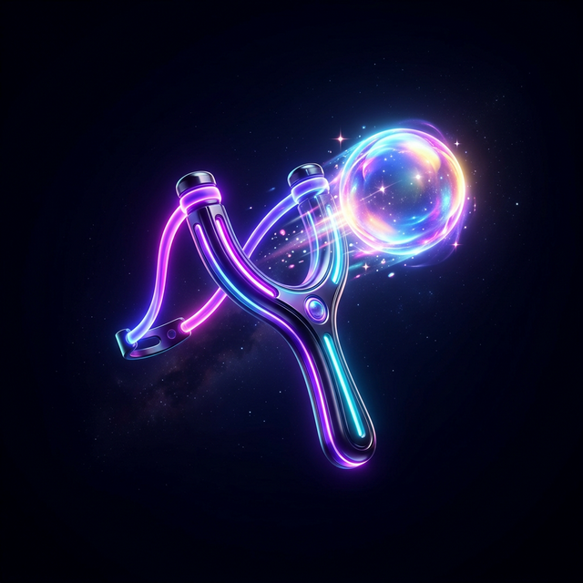
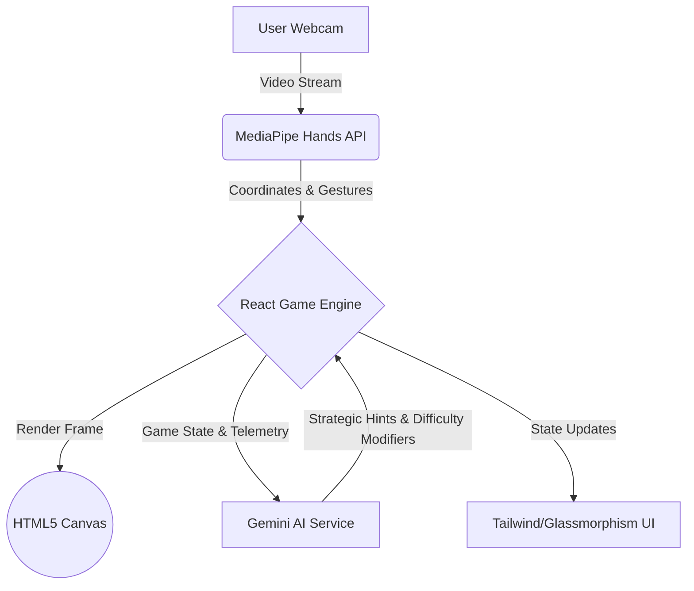
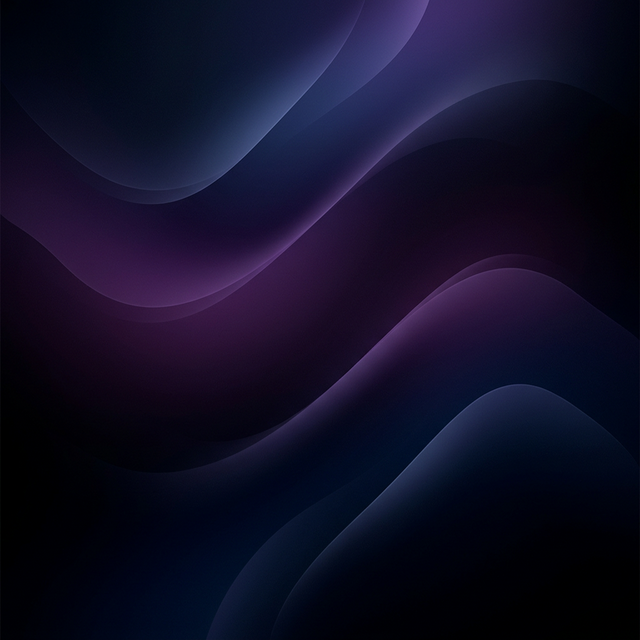

<div align="center">
  
  
  # 🎯 Bubble Slingshot 
  
  **An AI-Powered, Gesture-Controlled 3D Slingshot Experience**

  [](https://reactjs.org/)
  [](https://mediapipe.dev/)
  [](https://deepmind.google/technologies/gemini/)
  [](https://tailwindcss.com/)

  *A revolutionary take on the classic bubble shooter, entirely controlled by your hands and guided by artificial intelligence.*
</div>

---

## 🌟 Overview

**Bubble Slingshot** is a next-generation browser game that merges classic arcade mechanics with bleeding-edge web technologies. Say goodbye to the mouse and keyboard—this game is played entirely using **Hand Gesture Recognition** via your webcam. 

Coupled with a **Google Gemini AI** powered dynamic difficulty system, the game analyzes your gameplay in real-time to adjust the challenge and offer strategic hints, ensuring an immersive "flow state" experience.

---

## ✨ Core Features

| Feature | Description |
|---|---|
| 🖐️ **Gesture Control** | Play using real hand movements. Pinch, aim, and release to shoot, powered by MediaPipe's high-performance hand tracking. |
| 🧠 **AI Psychology Engine** | Gemini AI analyzes your gameplay, stress levels, and focus index in real-time. |
| 📊 **Dynamic Difficulty** | The game adjusts its speed and ceiling drops automatically based on your detected stress levels. |
| 💎 **Premium Glassmorphism UI** | A stunning, mobile-first dashboard featuring 3D ambient glows, frosted glass effects, and dynamic gradients. |
| 🌍 **Multi-Stage Campaign** | Progress through distinct worlds (Sea 🌊, Island 🏝️, Volcano 🌋) with increasing complexity. |
| 🌐 **Bilingual Support** | Full support for both English (LTR) and Arabic (RTL) interfaces. |

---

## 🏗️ Technical Architecture



### Stack Breakdown
- **Frontend Framework:** React (Vite) with TypeScript for robust, type-safe development.
- **Rendering:** Direct HTML5 Canvas `CanvasRenderingContext2D` for high-FPS 3D-styled graphics and particle effects.
- **Computer Vision:** `@mediapipe/hands` running client-side for ultra-low latency gesture recognition.
- **Styling:** Tailwind CSS handling complex responsive layouts, glassmorphism (`backdrop-blur`), and CSS animations.

---

## 🚀 Getting Started

To run this project locally, follow these steps:

### Prerequisites
- Node.js (v16.x or higher)
- A modern browser with Webcam access

### Installation

1. **Clone the repository**
   ```bash
   git clone <repository-url>
   cd slingshot
   ```

2. **Install dependencies**
   ```bash
   npm install
   ```

3. **Configure Environment Variables**
   Create a `.env` file in the root directory and add your Google Gemini API Key:
   ```env
   VITE_GEMINI_API_KEY=your_gemini_api_key_here
   ```

4. **Start the Development Server**
   ```bash
   npm run dev
   ```
   *The game will be available at `http://localhost:5173`. Accept camera permissions when prompted.*

---

## 🎮 How to Play

1. Stand or sit in a well-lit area so your webcam can clearly see your hand.
2. Bring your thumb and index finger together to **"Pinch"**.
3. A premium 3D wooden slingshot will appear on screen. 
4. **Pull back** your hand to stretch the elastic bands and aim.
5. **Release** the pinch to shoot the bubble!
6. Match 3 or more bubbles of the same color to pop them and clear the stage.

---

## 🎨 Design Philosophy

The game's UI was meticulously crafted to provide a **Premium High-Tech** aesthetic:
- **3D Rendered Canvas:** Bubbles feature accurate specular highlights, inner shadows, and dynamic glows. The slingshot launcher is rendered as a rich wooden fork with metallic joints.
- **Zero-Clutter HUD:** Hints and onboarding messages auto-hide as the player learns the mechanics.
- **Mobile-First Dashboard:** The main menu utilizes deep blur backdrops and stacks intelligently on mobile devices for ease of touch access.

---

<div align="center">
  
</div>

<br/>

<div align="center">
  <h3>Developed with 🩵 by</h3>
  <h2><strong>Abdessamad Bourkibate</strong></h2>
  <hr style="width: 200px; border-color: #42a5f5;" />
  <p><i>Software Engineer & Creative Technologist</i></p>
</div>
